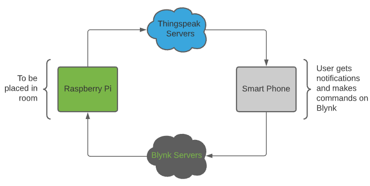

# IoT_Project_Semester4
Continuous assessment Project for IoT Standards and Protocols.

## Mood Moniter (MM)
`Student Name:` Mark Bates
`Student ID:` 20088639

## What is it?

This project is a prototype "mood moniter" or "self wellness check" that someone can use to moniter and track their mood from their phone or from a Raspberry Pi

---

## How it works

The project uses a combination of IOT applications and technologies to help the user log their mood aswell as use that data to send tweets or emails depending on what they set.
The project uses a python script that waits for an input from the user. The user sets their mood from their phone using an IoT app called Blynk. you can set your mood to one of
three options currently:
- happy
- normal
- sad

once set, the raspberry pi will recieve and send that data to a Thingspeak channel and plot it on a graph. it will then do one of three things:
`if happy:` thingspeak will tweet that the user is happy
`if normal:` thingspeak will do nothing
`if sad:` thingspeak will send out an email

##Further Development Options

This Project could be further developed on and take full advantage of IoT technologies. Using the pi, scripts could be created that can turn on and off appliances depending
on the mood. the Project could also have it's own dedicated app that sets and tracks the users mood. this could also lead to a more wide range of settings a user could give.

##Real World Applications

this project was aimed to be used in a number of environments. Possible uses could be in the social care sector. A social worker could recieve a message whenever a user has had their mood set to bad for a number of logs. They can then respond with a welness check.
Another area of use could be with children on the spectrum or who have a disability such as deafness. The app could work similarly with some changes.

## Tools, Tech and Equipment
The project uses the following:
- **Raspberry Pi**
- **Sense Hat**
- **Blynk**
- **thingspeak**

---

This project is coded using:
- **Python**
