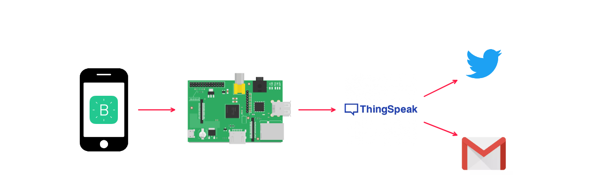
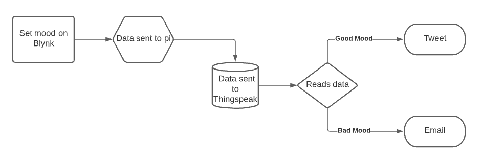
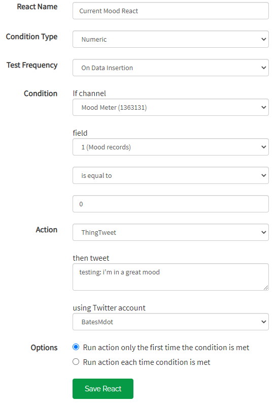
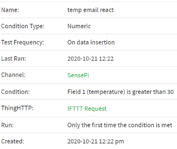
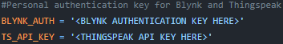

# IoT_Project_Semester4
Continuous assessment Project for IoT Standards and Protocols.

## Mood Moniter (MM)
`Student Name:` Mark Bates
`Student ID:` 20088639

## What is it?

This project is a prototype "mood moniter" or "self wellness check" that someone can use to moniter and track their mood from their phone or from a Raspberry Pi

## How it works

The project uses a combination of IOT applications and technologies to help the user log their mood aswell as use that data to send tweets or emails depending on what they set.
The project uses a python script that waits for an input from the user. The user sets their mood from their phone using an IoT app called Blynk. you can set your mood to one of
three options currently:
- happy
- normal
- sad

once set, the raspberry pi will recieve and send that data to a Thingspeak channel and plot it on a graph. it will then do one of three things:
`if happy:` thingspeak will tweet that the user is happy
`if normal:` thingspeak will do nothing
`if sad:` thingspeak will send out an email

---

---

## Further Development Options

This Project could be further developed on and take full advantage of IoT technologies. Using the pi, scripts could be created that can turn on and off appliances depending
on the mood. the Project could also have it's own dedicated app that sets and tracks the users mood. this could also lead to a more wide range of settings a user could give.

## Real World Applications

this project was aimed to be used in a number of environments. Possible uses could be in the social care sector. A social worker could recieve a message whenever a user has had their mood set to bad for a number of logs. They can then respond with a welness check.
Another area of use could be with children on the spectrum or who have a disability such as deafness. The app could work similarly with some changes.

---

## Tools, Tech and Equipment
The project uses the following:
- **Raspberry Pi**
- **Sense Hat**
- **Blynk**
- **thingspeak**
- **IFTTT**

This project is coded using:
- **Python**

# Project Setup
**make sure you have an account set up for all applications used**
## Blynk

1) set up a new workspace
2) chose the slider and Vlaue Display in the Widet Box
3) set the sliders output to V1 and it's min max to 0 and 2
4) set the Value Display Reading Rate to 30 seconds

## Thingspeak

1) create a new channel called Mood Meter with two fields: `field 1:` Mood Records, `field 2:` Temperature
2) go to API Key and take note of the first link under API Requests (you will need this later)
3) go to the ThingTweet option in Apps and link a twitter account 
4) next, go to the React option under Apps and create a new React and set it to the following:

**(be sure to set the twitter account to your linked account)**
5) go to IFTTT.com and click "create", then "add". chose the Webhooks service and choose the "Recieve a web request" option.
6) give it the name "Bad_Mood" and then create the trigger
7) click "Add" for the Then That card and chose Email. connect your email and set the Subject and Body to whatever you want.
8) once created, go to the "My services" under your account. Click Webhooks and then "Documentation" cset the event name to "Bad_Mood"
Copy the URL
9) back in Thingspeak, Go to Apps, then ThingHTTP. Create a new HTTP, set the Method to GET and pace the URL you got from the previous step into the URL box
10) Go bact to the React in Apps and create a new React with the following:

**(change channel names and your ThingHTTP name where appropriate)**

## Raspberry Pi

1) create a new Directory called "MoodMeter"
2) place the python file in the code section of this repository here
3) switch out the following placeholders with you Authentication keys for your Blynk project and Thingspeak channel

4) run the code and the project on Blynk, you should see an output on your terminal screen aswell as data being sent to your thingspeak channel.
