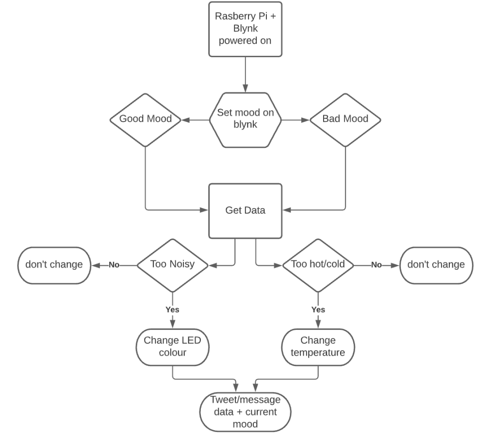

# IoT_Project_Semester4
Continuous assessment Project for IoT Standards and Protocols.

## Mood Moniter (MM)
`Student Name:` Mark Bates
`Student ID:` 20088639

## Project Description

For this project, i wish to build off what i did in my previous IoT project from last year, being the "Decibal Detector" that monitered audio and temperature levels. This project however will run solely on the Raspberry Pi and not on an arduino. Using help from applications like Blynk and possibly Thingspeak, the project will use a combination of the sensehat LEDs connected to the pi along with it's sensors to give data to the user. The user will use blynk to determine their current mood and they will recieve data related to the temperature and audio levels. They will also be given the option to adjust the temperature and possibly change the atmosphere of the room too.

The user will use Blynk to choose between a set number of moods, the pi will then end the temperature and audio data to the user who can decide if they want to turn up/down the temperature. Data may also be sent to the users email/social media stating their mood.

## Tools, Tech and Equipment
To get a working prototype of my proposed project, i will need:
- **Raspberry Pi**
- **Sense Hat**
- **Blynk**
- **thingspeak**
- (other hardware may be necessary)

---

This project will be coded using:
- **Python**
- (other coding languages may be used)
